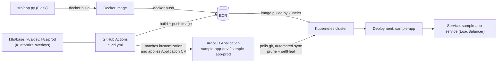

# Flask-ArgoCD-Kubernetes-Deployment

[](https://github.com/soodrajesh/Flask-ArgoCD-Kubernetes-Deployment/actions/workflows/ci-cd.yml)

This is a deliberately small Flask app used as a vehicle to build out a real GitHub Actions to ArgoCD to Kubernetes deploy path. The app itself does one thing: it returns `Hello from the {ENVIRONMENT} environment!` so you can tell at a glance which overlay (dev or prod) you're actually looking at. Everything interesting here is in the pipeline and the manifests, not the Python.

I built it this way to work through the GitOps split in practice: CI's job stops at building an image and telling ArgoCD what changed, it never runs `kubectl apply` against application manifests directly. ArgoCD owns reconciliation. That separation is the whole point of the exercise, and writing it out below made me find a real gap in my own pipeline (see "What's missing").

## Architecture



There are two ArgoCD Application definitions in this repo and they're not quite the same thing. `argocd-application.yaml` is a static manifest for a single Application named `sample-app`, always pointed at the `dev` namespace, meant to be applied by hand (`argocd-setup.sh` does this as part of a one-time bootstrap). `.github/workflows/ci-cd.yml` takes a different approach: on every push to `dev` or `main` it builds and pushes the image to ECR, then generates and applies its own Application object named `sample-app-dev` or `sample-app-prod` (branch-dependent), with `repoURL` set dynamically to the calling repo and `targetRevision` pinned to the triggering commit SHA. Both use `syncPolicy.automated` with `prune: true` and `selfHeal: true`, so once an Application exists, ArgoCD reverts manual `kubectl edit`s against it and removes resources dropped from the manifests, without a human clicking "sync."

The `argocd-setup.sh`/`argocd-install.sh` scripts and the static `argocd-application.yaml` are effectively the manual, pre-CI way of standing this up (they also configure ArgoCD's access to a private repo via a token pulled from AWS SSM). The GitHub Actions workflow is the automated version that grew out of that. I kept both in the repo because the manual path is still useful for a first-time bootstrap of ArgoCD itself on a fresh cluster; the workflow doesn't install ArgoCD, only the CD scripts do.

## Deliberately out of scope

- The CI pipeline patches image placeholders locally but never commits them back — ArgoCD clones the original, unresolved kustomization, not the patched one the runner built. Fixing it needs a decision about how the pipeline writes back to git (bot commit, image-updater, a separate manifests repo), so it's left as-is rather than guessed at.
- No environment separation beyond dev/prod namespaces on one cluster — no separate cluster per environment, no promotion gate beyond which branch triggered the build.
- The app runs on Flask's built-in dev server, not a WSGI server like gunicorn, and dependencies aren't pinned (`pip install flask`, no `requirements.txt`).

## Project structure

```
.
├── .github/workflows/ci-cd.yml   # builds/pushes image, creates ArgoCD Application per branch
├── Dockerfile
├── argocd-application.yaml       # static bootstrap Application (manual path)
├── argocd-install.sh             # installs ArgoCD on an EKS cluster, port-forwards the UI
├── argocd-service-account.yaml   # RBAC for a service account to drive ArgoCD's Application API
├── argocd-setup.sh               # bootstraps ArgoCD + private repo access + initial sync
├── dir.sh                        # one-off scaffolding script, not part of the deploy flow
├── k8s
│   ├── base
│   │   ├── deployment.yaml       # Deployment + Service (sample-app / sample-app-service)
│   │   └── kustomization.yaml
│   ├── dev
│   │   └── kustomization.yaml    # overlays base, sets ENVIRONMENT=dev
│   └── prod
│       └── kustomization.yaml    # overlays base, sets ENVIRONMENT=prod, replicas=2
└── src
    └── app.py                    # the whole app: one route, one env var
```

## How to run this

Build and run the container locally:

```bash
docker build -t sample-app:local .
docker run -p 5000:5000 -e ENVIRONMENT=local sample-app:local
curl localhost:5000
```

To push a real image and deploy through Kustomize by hand (i.e. doing what the CI workflow currently only half-does), resolve the placeholders yourself before applying:

```bash
export ECR_REGISTRY=<your-account>.dkr.ecr.<region>.amazonaws.com
export ECR_REPOSITORY=sample-app
export IMAGE_TAG=$(git rev-parse --short HEAD)

docker build -t $ECR_REGISTRY/$ECR_REPOSITORY:$IMAGE_TAG .
docker push $ECR_REGISTRY/$ECR_REPOSITORY:$IMAGE_TAG

cd k8s/dev
kustomize edit set image sample-app=$ECR_REGISTRY/$ECR_REPOSITORY:$IMAGE_TAG
sed -i '' "s|\${ECR_REGISTRY}|$ECR_REGISTRY|g; s|\${ECR_REPOSITORY}|$ECR_REPOSITORY|g; s|\${IMAGE_TAG}|$IMAGE_TAG|g" kustomization.yaml
cd -

kubectl apply -k k8s/dev
```

Commit that resolved `kustomization.yaml` if you want ArgoCD to pick it up via GitOps rather than applying it out of band.

To bootstrap ArgoCD itself on an EKS cluster (edit `EKS_CLUSTER_NAME` and `AWS_PROFILE` at the top of the script first):

```bash
./argocd-install.sh
```

Then point ArgoCD at this repo (update `repoURL` in `argocd-application.yaml` if you've forked it):

```bash
kubectl apply -f argocd-application.yaml
```

or run `./argocd-setup.sh`, which also wires up a private-repo access token pulled from AWS SSM Parameter Store.
